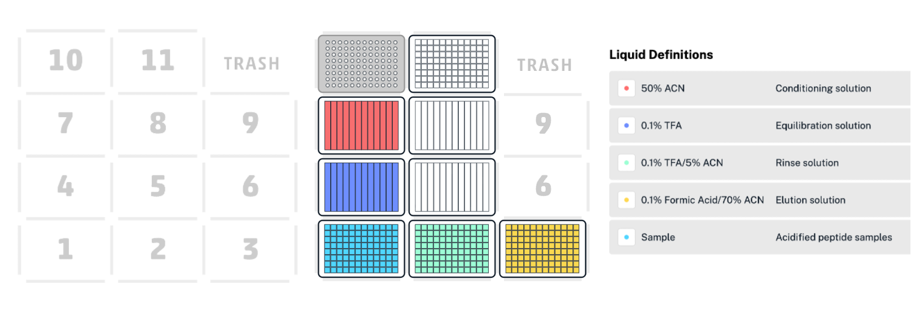

# Automated C18 Purification of Extracted Peptides for Metaproteomic MS Analysis

**Created by:** Paloma Lopez, Daniella Asturias, Mak Saito (February 2026)

---

## Supplies

- Pierce C18 Tips, 100 µL (Thermo Scientific, cat. 87784)
- 4× NEST 12-well reservoir, 15 mL (cat. nest-360102)
- 2× KingFisher shallow-well plate (cat. 97002540)
- 2× KingFisher deep-well plate (cat. 97002820)
- Opentrons OT-2

**Reagents:**

- 1% trifluoroacetic acid (TFA)
- 50% acetonitrile (ACN)
- 0.1% TFA
- 0.1% TFA / 5% ACN
- 0.1% formic acid / 70% ACN

> All solutions are prepared in LC/MS grade water (Optima W64).

---

## Procedure

### 1. Instrument Setup

1.1 Power on the OT-2 (switch located on the left rear of the instrument) and the connected computer.

1.2 In the Opentrons app, select protocol **C18_Peptide_Purification__96_Samples_v2.py** and connect to Opentrons instrument.

1.3 Verify all calibrations are ready:
   - Under Labware Offset, select **Run Labware Position Check** and follow on-screen instructions.
   - Confirm **Labware and Liquids** preferences. Scroll to the bottom of the page and select **Confirm Preferences**.

> **Important:** Labware position offsets are only applied after confirming preferences. Do not skip this step.

1.4 Complete all setup steps before preparing plates or starting the run.

---

### 2. Tip and Sample Preparation

2.1 Load only the number of C18 tips required for your sample set into a single tip rack. Inspect each tip to confirm the C18 filter fully covers the tip opening.

2.2 Transfer samples to a deep-well or shallow-well plate as appropriate.

---

### 3. Plate Preparation

Prepare all reagent and waste plates according to the table below, using a multichannel pipette:

| Solution | Plate type | Volume per well | Deck position |
|----------|-----------|-----------------|---------------|
| 50% ACN | NEST 12-well reservoir | 250 µL per tip | 7 |
| 0.1% TFA | NEST 12-well reservoir | 250 µL per tip | 4 |
| 2% DMSO / 0.1% TFA (samples) | KF deep-well or shallow-well plate | 100 µL per sample | 1 |
| 0.1% TFA / 5% ACN | KF deep-well plate | 230 µL per tip | 2 |
| 0.1% formic acid / 70% ACN | KF deep-well plate | 100 µL per tip (columns 1–6); 130 µL per tip (columns 7–12, if needed) | 3 |
| Waste — 50% ACN | NEST 12-well reservoir | Empty | 8 |
| Waste — 0.1% TFA | NEST 12-well reservoir | Empty | 5 |
| Waste — 0.1% TFA / 5% ACN | KF deep-well plate | Empty | 11 |

> **Note:** The additional 30 µL in columns 7–12 accounts for evaporation during the run.

---

### 4. Run

4.1 Place all plates in their designated deck positions as shown in the deck layout diagram below.

4.2 Start the run.

4.3 Monitor the first full cycle to confirm correct plate alignment and the absence of instrument crashes.
   - If the pipettor contacts a plate, cancel the run immediately and repeat the Labware Position Check before restarting.

4.4 Once all samples have been processed, cancel the program unless all 96 wells are in use.

---

### 5. Sample Recovery

5.1 Samples are eluted in 0.1% formic acid / 70% ACN. Transfer eluates to ethanol-washed 1.5 mL cryovials.

5.2 Dry samples in the SpeedVac at medium–low heat until completely dry.

5.3 Resuspend peptides in 2% ACN / 0.1% formic acid prior to MS injection.

---

## OT-2 Automated Steps (Reference)

The OT-2 executes the following sequence for each sample:

1. This step is usually done right after beads are removed from samples - acidify samples to ~0.1% TFA (target pH ~4) prior to loading.
2. Condition C18 tips by aspirating and discarding 100 µL of 50% ACN. Repeat once.
3. Equilibrate tips by aspirating and discarding 100 µL of 0.1% TFA. Repeat once.
4. Aspirate 100 µL of sample and dispense slowly through the C18 tip five times to bind peptides.
5. Wash by aspirating and discarding 100 µL of 0.1% TFA / 5% ACN. Repeat once.
6. Elute peptides by aspirating and dispensing 100 µL of 0.1% formic acid / 70% ACN through the tip five times into the collection plate.

---

## Editing the Protocol

1. In the Opentrons app, select **Protocol** and scroll to the bottom of the page.
2. Select **Protocol Designer** (opens in a new browser tab; requires internet connection).
3. Import the protocol from the device, make edits, then export back to the device.

---

> **Recommended best practices:**
> - Perform a Labware Position Check before every run.
> - Conduct a test run prior to processing samples.

---

## References

1. Thermo Scientific. Pierce® C18 Tips: Instructions for Use, version 2237.1 [Internet]. Thermo Fisher Scientific; [cited 2026]. Available from: https://assets.thermofisher.com/TFS-Assets%2FLSG%2Fmanuals%2FMAN0011713_Pierce_C18_Tip_UG.pdf# 
